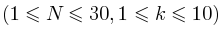

   

      <h1 class="title">22. Кузнечик</h1>
      <table>
         <tbody><tr class="time-limit">
            <td class="property-title">Ограничение времени</td>
            <td>1&nbsp;секунда</td>
         </tr>
         <tr class="memory-limit">
            <td class="property-title">Ограничение памяти</td>
            <td>64Mb</td>
         </tr>
         <tr class="input-file">
            <td class="property-title">Ввод</td>
            <td colspan="1">стандартный ввод или input.txt</td>
         </tr>
         <tr class="output-file">
            <td class="property-title">Вывод</td>
            <td colspan="1">стандартный вывод или output.txt</td>
         </tr>
      </tbody></table>
   

   <h2></h2>
   

         
У одного из студентов в комнате живёт кузнечик, который очень любит прыгать по клетчатой одномерной доске. Длина доски&nbsp;— N клеток. К его сожалению, он умеет прыгать только на 1, 2, …, k клеток вперёд. 
         

Однажды студентам стало интересно, сколькими способами кузнечик может допрыгать из первой клетки до последней. Помогите им
         ответить на этот вопрос.
      

   

   <h2>Формат ввода</h2>
   

         
В первой и единственной строке входного файла записано два целых числа&nbsp;— N и k .
         

   <h2>Формат вывода</h2>
   

         
Выведите одно число&nbsp;— количество способов, которыми кузнечик может допрыгать из первой клетки до последней.

   <h2>Пример</h2>
   <table class="sample-tests">
      <thead>
         <tr>
            <th>Ввод
<button class="button button_theme_pseudo button_size_s button_only-icon_yes problem__copy-button problem__copy-button_type_input i-bem" data-bem="{&quot;button&quot;:{}}" role="button" type="button" title="Скопировать ввод">&nbsp;</button>
</th>
            <th>Вывод
<button class="button button_theme_pseudo button_size_s button_only-icon_yes problem__copy-button problem__copy-button_type_output i-bem" data-bem="{&quot;button&quot;:{}}" role="button" type="button" title="Скопировать вывод">&nbsp;</button>
</th>
         </tr>
      </thead>
      <tbody>
         <tr>
            <td><pre>8 2
</pre></td>
            <td><pre>21
</pre></td>
         </tr>
      </tbody>
   </table>

