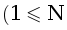
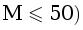

   

      <h1 class="title">28. Ход конём</h1>
      <table>
         <tr class="time-limit">
            <td class="property-title">Ограничение времени</td>
            <td>1&nbsp;секунда</td>
         </tr>
         <tr class="memory-limit">
            <td class="property-title">Ограничение памяти</td>
            <td>64Mb</td>
         </tr>
         <tr class="input-file">
            <td class="property-title">Ввод</td>
            <td colspan="1">стандартный ввод или input.txt</td>
         </tr>
         <tr class="output-file">
            <td class="property-title">Вывод</td>
            <td colspan="1">стандартный вывод или output.txt</td>
         </tr>
      </table>
   

   <h2></h2>
   

         
Дана прямоугольная доска N &times; M (N строк и M столбцов). В левом верхнем углу находится шахматный конь, которого необходимо переместить в правый нижний угол доски. В данной
            задаче конь может перемещаться на две клетки вниз и одну клетку вправо или на одну клетку вниз и две клетки вправо. 
         

Необходимо определить, сколько существует различных маршрутов, ведущих из левого верхнего в правый нижний угол. 

      

   

   <h2>Формат ввода</h2>
   

         
Входной файл содержит два натуральных числа N и M , .
         

   <h2>Формат вывода</h2>
   

         
В выходной файл выведите единственное число&nbsp;&mdash; количество способов добраться конём до правого нижнего угла доски.

   <h3>Пример 1</h3>
   <table class="sample-tests">
      <thead>
         <tr>
            <th>Ввод</th>
            <th>Вывод</th>
         </tr>
      </thead>
      <tbody>
         <tr>
            <td><pre>3 2
</pre></td>
            <td><pre>1
</pre></td>
         </tr>
      </tbody>
   </table>
   <h3>Пример 2</h3>
   <table class="sample-tests">
      <thead>
         <tr>
            <th>Ввод</th>
            <th>Вывод</th>
         </tr>
      </thead>
      <tbody>
         <tr>
            <td><pre>31 34
</pre></td>
            <td><pre>293930
</pre></td>
         </tr>
      </tbody>
   </table>

