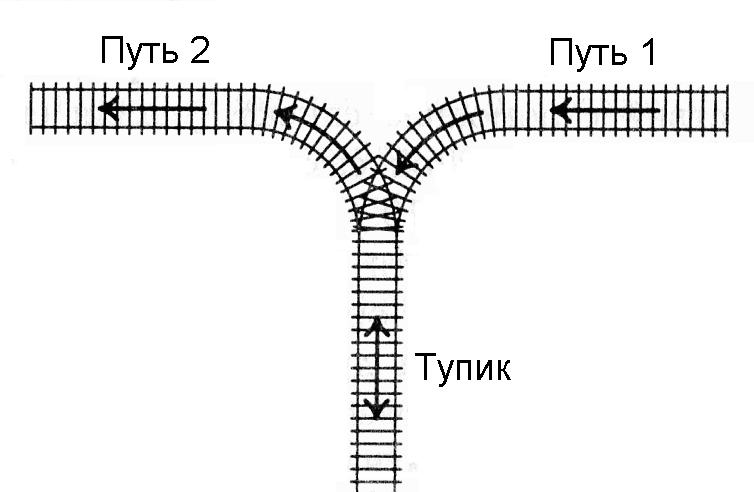

   

      <h1 class="title">14. Сортировка вагонов lite</h1>
      <table>
         <tr class="time-limit">
            <td class="property-title">Ограничение времени</td>
            <td>1&nbsp;секунда</td>
         </tr>
         <tr class="memory-limit">
            <td class="property-title">Ограничение памяти</td>
            <td>64Mb</td>
         </tr>
         <tr class="input-file">
            <td class="property-title">Ввод</td>
            <td colspan="1">стандартный ввод или input.txt</td>
         </tr>
         <tr class="output-file">
            <td class="property-title">Вывод</td>
            <td colspan="1">стандартный вывод или output.txt</td>
         </tr>
      </table>
   

   <h2></h2>
   

         
К тупику со стороны пути 1 (см. рисунок) подъехал поезд. Разрешается отцепить от поезда один или сразу несколько первых вагонов
            и завезти их в тупик (при желании, можно даже завезти в тупик сразу весь поезд). После этого часть из этих вагонов вывезти
            в сторону пути 2. После этого можно завезти в тупик еще несколько вагонов и снова часть оказавшихся вагонов вывезти в сторону
            пути 2. И так далее (так, что каждый вагон может лишь один раз заехать с пути 1 в тупик, а затем один раз выехать из тупика
            на путь 2). Заезжать в тупик с пути 2 или выезжать из тупика на путь 1 запрещается. Нельзя с пути 1 попасть на путь 2, не
            заезжая в тупик.
         

      
Известно, в каком порядке изначально идут вагоны поезда. Требуется с помощью указанных операций сделать так, чтобы вагоны
         поезда шли по порядку (сначала первый, потом второй и т.д., считая от головы поезда, едущего по пути 2 в сторону от тупика).
         Напишите программу, определяющую, можно ли это сделать.
      

   

   <h2>Формат ввода</h2>
   

         
Вводится число N — количество вагонов в поезде (1 ≤ N ≤ 100). Дальше идут номера вагонов в порядке от головы поезда, едущего
            по пути 1 в сторону тупика. Вагоны пронумерованы натуральными числами от 1 до N, каждое из которых встречается ровно один
            раз.
         

   

   <h2>Формат вывода</h2>
   

         
Если сделать так, чтобы вагоны шли в порядке от 1 до N, считая от головы поезда, когда поезд поедет по пути 2 из тупика, можно,
            выведите сообщение YES, если это сделать нельзя, выведите NO.
         

   

   <h3>Пример 1</h3>
   <table class="sample-tests">
      <thead>
         <tr>
            <th>Ввод</th>
            <th>Вывод</th>
         </tr>
      </thead>
      <tbody>
         <tr>
            <td><pre>3
3 2 1
</pre></td>
            <td><pre>YES
</pre></td>
         </tr>
      </tbody>
   </table>
   <h3>Пример 2</h3>
   <table class="sample-tests">
      <thead>
         <tr>
            <th>Ввод</th>
            <th>Вывод</th>
         </tr>
      </thead>
      <tbody>
         <tr>
            <td><pre>4
4 1 3 2
</pre></td>
            <td><pre>YES
</pre></td>
         </tr>
      </tbody>
   </table>
   <h3>Пример 3</h3>
   <table class="sample-tests">
      <thead>
         <tr>
            <th>Ввод</th>
            <th>Вывод</th>
         </tr>
      </thead>
      <tbody>
         <tr>
            <td><pre>3
2 3 1
</pre></td>
            <td><pre>NO
</pre></td>
         </tr>
      </tbody>
   </table>

